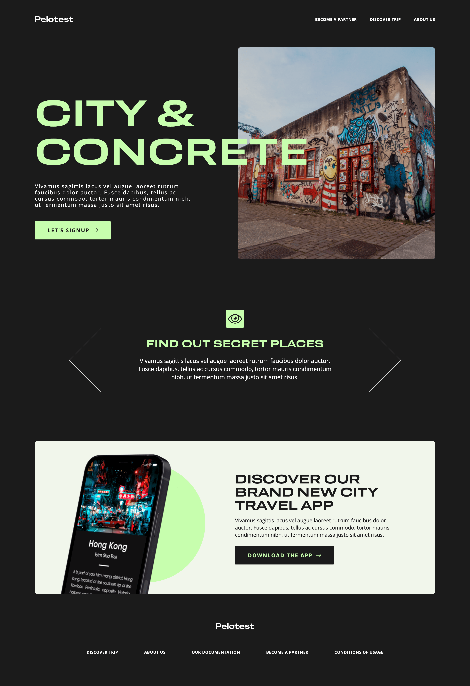

# Pelotest

A landing page for a fictional Travel App

Design by [Pelo Studio](https://pelo.studio/) !

## Hi ! 👋

**Thanks for checking out this [project](https://pelotest-app.netlify.app/) !**

## General info

- Mobile First Responsive Design
- Mobile menu
- Slideshow

## Built with

          

## Want to see more ?

**Check out my [portfolio](https://www.davidyvon.com) !**
